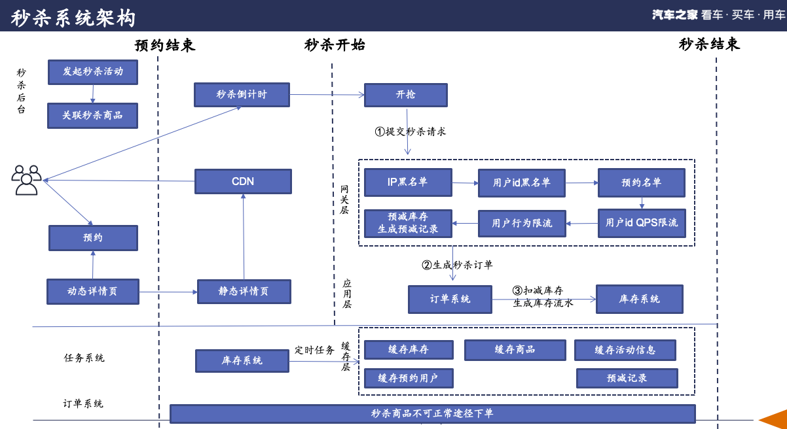
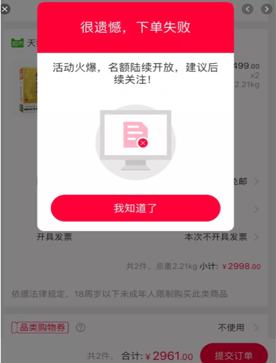
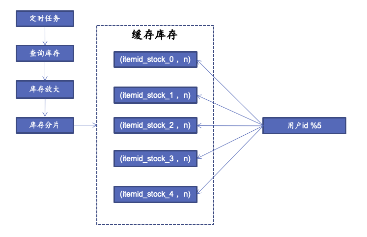

## 前言

秒杀作为一种营销工具，利用限时限量，先到先得的用户心理，刺激购买或制造机会吸引用户关注，不仅能短时间带动商品的销量提升，还可以聚集大量的人气。是各大平台的运营人员和商家在活动期间最常用的营销工具。

汽车之家电商平台厂商旗舰店业务主要服务于各大汽车厂商，将主机厂商的车型以及优惠通过抵扣券商品的形式投放在之家商城，通过线上支付，上传发票，运营核销的方式来完成交易闭环。抵扣券的秒杀与一般的单品秒杀系统存在着不一样的要求，具有以下特点：

第一，秒杀单品面值大。各大汽车厂商在之家商城上售出的抵扣券商品的现金权益可能会超过3-5万，这种大额面值的券会吸引大量职业黑产，他们会利用自己的号池、IP池、爬虫等手段一直来刷下单。

第二，秒杀库存少。优惠力度大，库存数量少，应尽量保证让真正的用户抢到，而不是黑产靠工具刷到。整个秒杀系统不仅对性能有要求，对风控系统的精准度也有着很高的考验。

## 秒杀系统整体架构

秒杀场景下带来的海量用户所造成的流量突增对系统冲击力可想而知，瞬时流量之高一方面造成的读写冲突，数据库锁会非常严重，另一方面应用服务器能否撑住也是一个问题。同时由于秒杀业务一般是各种活动带来，需要快速上下线，这在开发上也会提出更高的标准，快速支持需求而不出错。从系统上讲我们要做到高可用和高并发；从开发效率上我们要做到敏捷开发以支持产品快速迭代。

整个秒杀系统基于架构的**合适原则、简单原则、演化原则**三原则来设计，通过了解业界秒杀系统的架构以及结合业务现状制定改造计划，分阶段执行。2020年4月份上线以来已经承担70余场次的秒杀活动，最高12场秒杀活动同时开启。

系统整体架构图如下：



在秒杀开始前运营人员需要在秒杀管理后台创建一场秒杀活动，设置是否需要预约、预约的开始和结束时间、以及秒杀的开始结束时间。当秒杀活动的预约开始后商品变为不可购买状态，用户只能对商品进行预约。预约后会系统会根据风控中心给出的评分来确定用户是否进入用户id黑名单。

预约结束后秒杀开始前，定时任务会将一些已知道的IP黑名单、用户id黑名单、预约名单、商品信息和活动信息预热到缓存里。当下单请求或者秒杀请求提交到网关层的时候，先会根据商品id查询出当前的商品是否有秒杀活动信息，以及活动的开始时间和结束时间。如果是商品参与了秒杀则进行IP黑名单，用户ID黑名单，预约名单，用户QPS限流的校验，如果都通过则请求缓存对缓存里的库存进行预减缓存库存的操作，如果预减成功则提交请求应用层的订单中心生成秒杀订单。

### 秒杀模型选择

业界的秒杀模型大致分为两种类型：同步秒杀模型和异步秒杀模型。

同步秒杀模型即抢购后不能立即知道抢购结果，在抢购结果等待页通过轮询后台接口或者与后台的长链接来获取秒杀结果。异步秒杀模型核心思想是利用MQ的削峰，将用户的请求峰值摊平到应用层可以接受的范围。这种模型适合无预约场景，秒杀库存量大，单次秒杀活动订单量大的场景比如直播带货。这种秒杀模型的缺点就是如果用户异步等待时间过长的话会给没有抢到的用户一种有猫腻的感觉，用户体验会差一些。

 


同步秒杀模型即抢购立刻知道抢购结果，用户体验会好一些。适用于秒杀库存量少，商品价值高，通常需要结合预约、风控系统来完成。业界典型的案例京东、苏宁抢购茅台。



随着云原生架构在之家范围内普及和深入使用，应用的扩容不再需要运维人员和开发人员来手工操作配置，可以在秒级内完成。上秒杀开始前对应用进行扩容，秒杀结束后对应用进行缩减。相信未来更多的秒杀系统会使用同步秒杀模型。

### 库存扣减设计

秒杀系统中，库存是个关键数据，卖不出去是个问题，超卖更是个问题。秒杀场景下的一致性问题，主要就是库存扣减的准确性问题。电商场景下的购买过程一般分为两步：下单和付款。“提交订单”即为下单，“支付订单”即为付款。基于此设定，减库存一般有以下几个方式：

1. 下单减库存。买家下单后，扣减商品库存。下单减库存是最简单的减库存方式，也是控制最为精确的一种
2. 付款减库存。买家下单后，并不立即扣减库存，而是等到付款后才真正扣减库存。但因为付款时才减库存，如果并发比较高，可能出现买家下单后付不了款的情况，因为商品已经被其他人买走了
3. 预扣库存。这种方式相对复杂一些，买家下单后，库存为其保留一定的时间（如 15 分钟），超过这段时间，库存自动释放，释放后其他买家可以购买。

综合考虑之后三种减库存的优劣之后我们采取的是下单减库存的方式。下单减库存的优势在于用户体验最好，也是最简单，控制最精确的一种方式。下单时可以直接通过数据库事务机制控制商品库存，所以一定不会出现已下单却付不了款的情况。劣势在于可能卖不出去，但是考虑到实际场景是库存少，面额巨大，一般不会有恶意下单不付款的情况。

## 高性能架构

### 网关层技术选型

在网关层先我们选择使用OpenResty，其是由Nginx核心加很多第三方模块组成，其最大的亮点是默认集成了Lua开发环境，使得Nginx可以作为一个Web Server使用。借助于Nginx的事件驱动模型和非阻塞IO，可以实现高性能的Web应用程序。并且OpenResty提供了大量组件如Mysql、Redis、Memcached等，使在Nginx上开发Web应用更方便更简单。

### 缓存预热

通过定时任务会将一些已知道的IP黑名单、用户id黑名单、商品预约名单、商品信息和活动信息预热到缓存里。通过使用OpenResty+Redis开发的API可以轻松达到上万的QPS。

### 分层限流

盯过秒杀流量监控的话，会发现它不是一条蜿蜒而起的曲线，而是一条挺拔的直线，这是因为秒杀请求高度集中于某一特定的时间点。这样一来就会造成一个特别高的零点峰值，而对资源的消耗也几乎是瞬时的。但是库存又很少，所以我们需要分层限流，将尽可能少的请求拦截到应用层之前。


### 扣减库存

下单减库存在数据一致性上，主要就是保证大并发请求时数据库中的库存字段值不能为负数，一般我们有多种解决方案：一种是在应用程序中通过事务来判断，即保证减后库存不能为负数，否则就回滚；另一种办法是直接设置数据库的字段数据为无符号整数，这样减后库存字段值小于零时会直接执行SQL语句来报错；再有一种就是使用CASE WHEN判断语句，例如这样的SQL语句：

`UPDATE item SET inventory = CASE WHEN inventory &gt;= xxx THEN inventory-xxx ELSE inventory END`

由于扣减库存不仅有更新商品库存操作，也有写入日志等SQL操作。所以做法有两种：

方法1

```
start transaction
insert change_log
update stock set num=num-? where sku_id=？and num>=0;
end  transaction
```

方法2

```
Start transaction
update stock set num=num-? where sku_id=？and num>=0;
insert change_log
end  transaction
```

由于MySQL存储数据的特点，同一数据在数据库里肯定是一行存储（MySQL），因此会有大量线程来竞争InnoDB行锁，而并发度越高时等待线程会越多，TPS会下降，响应时间（RT）会上升，数据库的吞吐量就会严重受影响。所以推荐使用方法1。如果change_log表数据量很大，写入耗时性能较差，可以考虑定期对历史数据进行归档。

## 高可用架构

稳定性是一个平时不重要，但出了问题就要命的事情，保障关键流程在应对大量请求时能稳定运行，做到这一点，需要很高的系统可用性。因此，业务流程和数据流程要尽量精简，减少容易出错的环节。此外，cache、DB、网络、容器环境，任何一个部分都有可能会出现短时故障，我们需要提前做处理预案。针对以上的目标难点，我们总结了如下的实践经验。

### 缓存高可用

秒杀是一个读多写少的场景，使用redis做缓存再合适不过。不过考虑到缓存击穿问题，我们采用了高可用的codis集群，提升了整个秒杀系统的性能和可用性。

在上面提到的分层限流中，多数我们都使用到了缓存，缓存的高可用性将影响到整个系统的高可用性。缓存系统采用开源的codis架构。通过分片实现容量扩展，通过主从复制实现节点的高可用。

一个codis实例可以连接多个redis实例，也可以启动多个codis实例来支撑，每个codis节点都是对等的，这样可以增加整体的QPS需求，还能起到容灾功能。

### 热点隔离

在Redis中存储秒杀商品的库存数量时，可以将秒杀商品的库存进行“分割”存储来提升Redis的读写并发量。

例如，原来的秒杀商品的id为10001，库存为10件，在Redis中的存储为(10001, 2)，我们将原有的库存分割为5份，则每份的库存为2件，此时，我们在Redis中存储的信息为(10001_0, 2)，(10001_1, 2)，(10001_2, 2)，(10001_3, 2)，(10001_4, 2)。





另外库存分片也能够有效的缓解redis的热点key问题，codis是按key进行分槽存储，将同一库存的key分散到不同的codis组里，可以有效的平衡整个集群中各组的访问量。

### 熔断

通过分析整个秒杀的关键链路是查询库存信息，查询风控信息，查询促销信息，扣减库存以及订单入库。在这些关键路径上调用的接口上的调用方做了Hystrix熔断措施，通过使用使用Hystrix，我们能方便的防止雪崩效应，同时使系统具有自动降级和自动恢复的效果。

### 限流

在整个秒杀系统中，相关的读数据的操作基本上都使用缓存来保证系统的高性能，在扣间库存和生成订单的场景直接面对的是数据库。当数据库面临大量写入操作的时候，磁盘IO会急剧增加，导致响应时间变长。

通过限流可以对并发访问/请求进行限速或者一个时间窗口内的的请求进行限速来保护系统，一旦达到限制速率则可以拒绝服务或进行流量整形。通过在服务提供方做了guava令牌桶算法限流，从而保证系统的高可用。

```java
RateLimiter rateLimiter = RateLimiter.create(20);
System.out.println(rateLimiter.acquire(5));
```

### 过载保护

在我们制定完系统的性能指标参考值后，借助之家云平台提供的压测工具AutoTPS，我们在有限的资源里实现了对整个系统的端到端全链路压测。实测中，我们的核心接口在单个容器上可以达到 20,000 以上的 QPS，整个服务集群在 110,000 以上的 QPS 压力下依然能稳定工作。

正是一次次的全链路压测参考指标，帮助我们了解了性能的基准，并以此做了代码设计层面、容器层面、JVM 层面、MySQL 数据库层面、缓存集群层面的种种优化，极大的提升了系统的可用性。具体做法限于篇幅不在此赘述，有兴趣的读者欢迎交流。

此外，为了确保线上有超预估流量时系统稳定，我们做了过载保护。超过性能上限阈值的流量，系统会快速返回特定的页面结果，将此部分流量清理掉，保障已经接受的有效流量可以正常处理。

## 安全架构

#### 预约风控机制

将厂商旗舰店的购车权益发放到真实的购车用户手里，这是整个车电商秒杀系统的核心关注点。当用户点击预约后台生成预约记录之后，会异步请求之家的用户风控接口，此风控接口结合了用户在之家的行为轨迹、用户画像、以及在全网内的信誉评分（第三方提供）等维度给用户给一个风险评估分，高于风险阈值的用户将会被直接拉到用户黑名单。

#### 用户行为风控

经过多次秒杀之后的复盘验证之后我们发现一个问题，就是黑产直接跳过了结算页，直接访问的下单URL，这样就显得对普通用户不公平。我们的做法是在秒杀的结算页生成ordertoken，当用户提交到下单页的是时候判断是否有ordertoken以及token生成的时间是否大于1s（结算页需要输入用户手机号和姓名）。通过用户行为风控来将真正的黑产拒之门外。

## 未来展望

### 动静分离

不同秒杀系统架构设计的入口是不一样，可以是商品详情页发起秒杀请求，也可以是购物车发起下单请求。我们的做法是将秒杀的入口放在了商品详情页，带有秒杀标识的商品不允许加入购物车。

在秒杀开始前用户会集中打开详情页，一个html页面还是比较大的，即使做了压缩，http头和内容的大小也可能高达数十K，加上其他的css， js，图片等资源，如果同时有几百万人参与一个商品的抢购，一般机房带宽也就只有1G10G，网络带宽就极有可能成为瓶颈。

由于在抢购过程中，用户在整个页面的关注点只有秒杀倒计时，所以在秒杀开始前可以将商品详情页静态化，并推送到CDN服务器，倒计时组件的时间从服务端的接口取。实现数据意义上的动静分离从而实现前端的高性能。

由于CDN节点遍布全国各地，能缓冲掉绝大部分的压力，而且还比机房带宽便宜。

### 双活部署

之家云平台自上线以来已经为整个公司提供了统一的云原生环境，编译上线


### 隔离部署


### 完善监控

之家云平台提供了完美的监控系统，能够帮我们观测到关键的指标，如服务接口的性能指标，整体的网络状况、服务基础设施、JVM的GC情况，并且能够在超过预估时制定的阈值时，能够实时的通过手机和邮件实时通知的方式让相关人员知道。


但是在业务层面的监控，现在只有后台接口来查询缓存里的数据是否正确，当前有多少场秒杀，是否生成了秒杀订单等。


另外，我们在系统中还做了若干逻辑开关，当某些资源出现问题并且自动降级和过载保护模块失去效果时，我们可以根据状况直接人工介入，在服务不停机的前提下，手动触发逻辑开关改变系统逻辑，达到快速响应故障，让服务尽快恢复稳定的目的。


## 总结

一个秒杀系统的设计，可以根据不同级别的流量，由简单到复杂打造出不同的架构，本质是各方面的取舍和权衡。

作为架构师，应该时刻提醒自己主线是什么。遵循简单原则、迭代原则。


## 附架构评审的问题

**为什么没有设计答题、排队、验证码系统来削峰**？

答题、排队、验证码可以人为拉长峰值下单的时长，由之前的 <1s 延长到 <10s。这个时间对于服务端非常重要，会大大减轻高峰期并发压力。并且能够难道一些爬虫用户，但是并不能拦住专业的黑产用户。在秒杀系统上了之家云Docker集群后，综合考虑性能、用户体验，将秒杀排队的机制给去掉，减少真正的用户的提交秒杀请求的时间。

**为什么没有使用动态URL**

综合分析发现动态url的带来的ROI成本低，生成的url需要存储在缓存里，对缓存也是多了一层压力。

**为什么没有使用mq来削峰**

根据奥卡姆剃刀原则如非必要，不要引入新的实体。

**秒杀系统容易出问题的点**

应用突增的网络及服务器宽带、以及需要提前评估好codis集群的容量以及网络带宽。